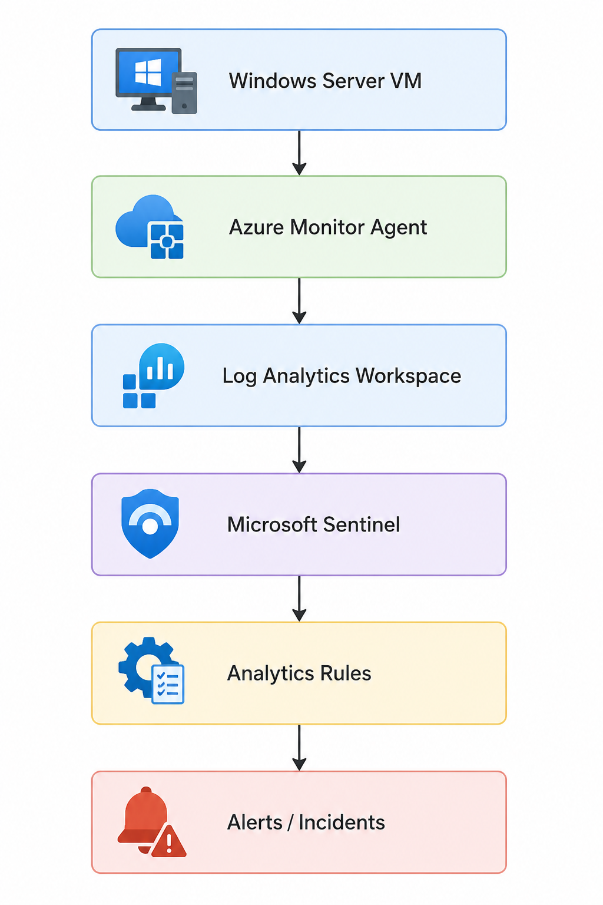
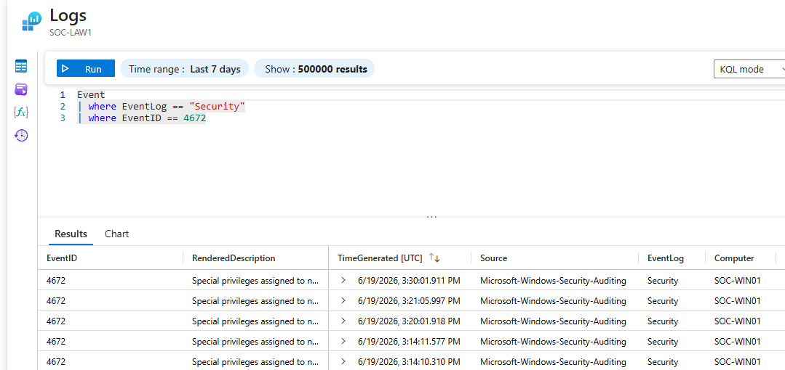
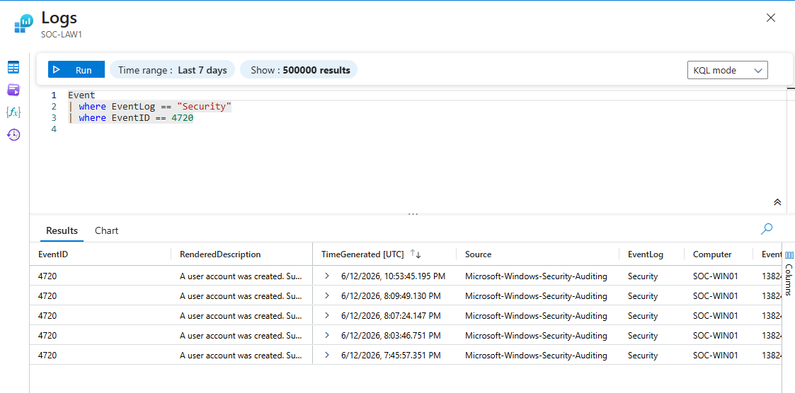
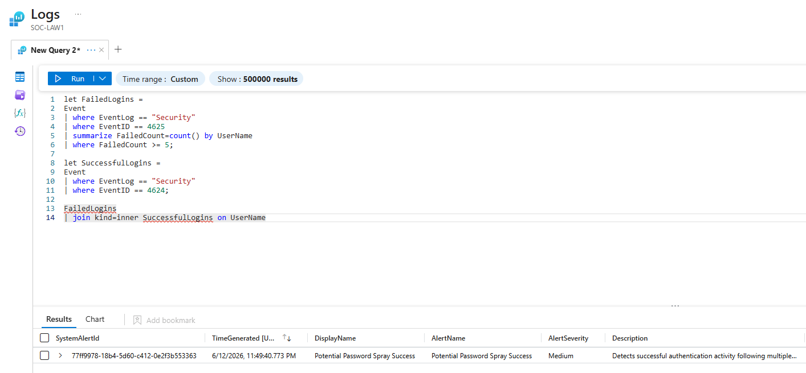

# Cloud SOC & Detection Engineering Lab — Microsoft Sentinel (SIEM) | Azure | KQL

## Overview

This project demonstrates the deployment of a cloud-based Security Operations Center (SOC) environment using Microsoft Sentinel, Azure Monitor, Log Analytics, and a Windows Server endpoint.

The goal was not simply to create detections, but to think like a SOC analyst by:

- Collecting endpoint telemetry in a cloud SIEM
- Building custom detections using KQL
- Mapping detections to the MITRE ATT&CK framework
- Tuning alerts to reduce false positives
- Prioritizing incidents based on risk and confidence
- Investigating simulated attack activity

Rather than generating incidents for every security event, detections were deliberately tuned to reflect realistic SOC workflows where low-confidence events provide visibility and supporting context, while high-confidence, correlated events generate actionable incidents. This distinction is what separates a functional detection engineering program from one that drowns analysts in noise.

---

## Skills Demonstrated

- Microsoft Sentinel Deployment
- Kusto Query Language (KQL)
- Security Event Analysis
- MITRE ATT&CK Mapping
- Incident Response
- Alert Tuning
- Authentication Monitoring
- Security Operations Workflows

---

# Lab Architecture

Telemetry was collected from a Windows Server virtual machine using the Azure Monitor Agent (AMA) and forwarded into a Log Analytics Workspace, which Microsoft Sentinel consumed as its data source.

This architecture mirrors how enterprise SOC environments typically ingest endpoint telemetry; the agent handles local log collection and secure forwarding, the workspace provides centralized storage and query capability, and Sentinel sits on top as the analytics and incident management layer.

## Architecture Diagram

  

---

# Environment Setup

## Azure Resources

The environment consisted of:

- Windows Server Virtual Machine
- Azure Monitor Agent
- Log Analytics Workspace
- Microsoft Sentinel
- Data Collection Rule (DCR)

### Azure Resource Group

  

---

## Endpoint Configuration

A Windows Server VM was deployed to simulate an enterprise endpoint and generate realistic security telemetry. Windows Server was selected specifically because it produces the Security Audit event logs central to this lab. Event IDs in the 4xxx range that cover logon activity, privilege use, and account management.

### Windows Server VM

  

## Data Collection Rule (DCR)

A Data Collection Rule (DCR) was configured and associated with the Windows Server endpoint. The DCR acts as the policy layer that tells the Azure Monitor Agent exactly what to collect and where to send it. Without a DCR, the agent installs but collects nothing.

The DCR was scoped to Windows Security Audit events only, keeping ingestion focused on the event categories relevant to detection engineering rather than pulling in noisier sources like Application or System logs.

Collected Security Event Categories:

- Audit Success
- Audit Failure

These security audit logs contained the telemetry used throughout the project, including:

| Event ID | Description |
|-----------|-------------|
| 4624 | Successful Logon |
| 4625 | Failed Logon |
| 4672 | Privileged Logon |
| 4720 | User Account Creation |

  

The DCR served as the bridge between the endpoint and Microsoft Sentinel, enabling security event ingestion and detection engineering. This separation of concerns (agent, DCR, workspace, SIEM) is an important architectural pattern in modern cloud security deployments because it allows each layer to be modified independently.

# Log Analytics Workspace (LAW)

A Log Analytics Workspace was deployed to serve as the central repository for collected endpoint telemetry.

The workspace stores security events collected by the Azure Monitor Agent and provides the data source queried by Microsoft Sentinel analytics rules. All KQL queries in this project execute against data stored here. Sentinel itself does not store logs, it queries them.

Responsibilities of the Log Analytics Workspace included:

- Centralized log storage
- KQL query execution
- Security event retention
- Data source for Microsoft Sentinel detections

This distinction matters operationally: the workspace is where data lives and where query performance tuning happens, while Sentinel is where that data becomes security intelligence.

# Microsoft Sentinel

Microsoft Sentinel was deployed as the Security Information and Event Management (SIEM) platform for the lab.

Sentinel consumes telemetry stored within the Log Analytics Workspace and enables:

- Detection engineering
- Alert generation
- Incident creation
- Threat hunting
- MITRE ATT&CK mapping
- Security investigations

Unlike the Log Analytics Workspace, which primarily stores and indexes data, Sentinel provides the security analytics and incident response capabilities that SOC analysts actually work from day to day. Analytics rules run on a schedule against the workspace data, evaluate logic, and when conditions are met, generate alerts that can be promoted into incidents.

The platform was used to create custom analytics rules, correlate suspicious activity across multiple event types, and generate incidents based on simulated attack scenarios.

  

---

## Log Collection Validation

Before building any detections, ingestion had to be confirmed. Two validation checks were performed: heartbeat connectivity and security event presence. This step matters because silent ingestion failures are a real operational risk. If logs stop flowing and no one notices, detections keep running against stale or absent data.

### Example Security Events Collected

| Event ID | Description |
|----------|-------------|
| 4624 | Successful Logon |
| 4625 | Failed Logon |
| 4672 | Special Privileges Assigned |
| 4720 | User Account Created |

### Heartbeat Validation

The Heartbeat table was queried to confirm the Azure Monitor Agent was actively communicating with the Log Analytics Workspace. Each heartbeat record represents a successful check-in from the agent. Gaps in heartbeat data would indicate connectivity or agent health issues that would affect log delivery.

  

### Security Event Validation

With heartbeat confirmed, the SecurityEvent table was queried directly to verify the expected event IDs were being collected. Seeing real event records with populated fields like AccountName, LogonType, and IpAddress confirmed the DCR was correctly scoped and the pipeline was functioning end to end.

  

# Detection Engineering

The following detections were developed and mapped to MITRE ATT&CK techniques. Each rule was evaluated not just on whether it could fire, but on whether it *should* fire - and what action, if any, an analyst should take as a result. That framing drove the incident creation decisions throughout.

---

# Failed Authentication Burst

## Objective

Detect repeated authentication failures which may indicate password guessing or brute-force activity.

### Event ID

**4625 – Failed Logon**

### MITRE ATT&CK

**T1110 – Brute Force**

Attackers frequently attempt repeated authentication against valid accounts, either through traditional brute force (many passwords against one account) or lower-volume credential stuffing.

### Detection Logic

Triggers when five or more failed authentication events are observed within the query window. The threshold of five was chosen to filter single-user typos while still catching sustained failure patterns.

### Severity

**Low**

### Incident Creation

**Disabled**

### SOC Rationale

This rule intentionally does not generate incidents.

Failed logins occur at high volume in enterprise environments for entirely legitimate reasons:

- Users mistyping passwords
- Forgotten credentials after password resets
- Service accounts with stale cached credentials
- Application authentication failures after configuration changes

Generating incidents for every burst of failed logins would create alert fatigue that degrades analyst response to events that actually matter. The value here is in the data. Having 4625 events available in the workspace means that when a higher-confidence alert fires, analysts can pull this telemetry as supporting context during investigation.

### Detection Results

  

---

# Successful Authentication Activity

## Objective

Monitor successful authentication activity across the endpoint.

### Event ID

**4624 – Successful Logon**

### MITRE ATT&CK

**T1078 – Valid Accounts**

Threat actors who successfully compromise credentials will authenticate using those credentials which means their activity looks identical to legitimate user behavior at the individual event level.

### Detection Logic

Detects successful authentication events. The rule captures logon type, account name, and source address to provide context for downstream investigation.

### Severity

**Informational**

### Incident Creation

**Disabled**

### SOC Rationale

Successful logins are among the highest-volume events in any Windows environment. Creating incidents for routine user authentication would produce thousands of daily alerts with almost no signal. The analytical value of 4624 events comes from correlation. A successful logon is meaningful when it follows multiple failures, occurs at an unusual hour, or appears on an account that doesn't typically authenticate interactively. On its own, it's baseline telemetry.

### Detection Results

  

---

# Privileged Logon Detected

## Objective

Monitor use of elevated privileges during logon sessions.

### Event ID

**4672 – Special Privileges Assigned to New Logon**

### MITRE ATT&CK

**T1078 – Valid Accounts**

After initial access, attackers frequently seek to escalate to privileged accounts to expand their access, move laterally, or achieve persistence. 4672 events fire when a logon session is granted sensitive privileges such as SeDebugPrivilege or SeImpersonatePrivilege.

### Detection Logic

Triggers when elevated privileges are assigned during authentication. The detection captures which privileges were granted and to which account.

### Severity

**Informational**

### Incident Creation

**Disabled**

### SOC Rationale

Administrative logons are routine in managed enterprise environments. Domain admins, IT staff, and service accounts regularly trigger 4672 events during normal operations. Generating incidents for every privileged logon would bury analysts in noise from legitimate administrative activity. However, this telemetry becomes highly valuable when correlated with other suspicious behavior. A 4672 event following failed authentication attempts, for example, is a different story than a standalone administrative login.

### Detection Results

  

---

# Unauthorized Local Account Persistence Detection

## Objective

Detect creation of local user accounts, which may indicate an attacker establishing persistence on the endpoint.

### Event ID

**4720 – User Account Created**

### MITRE ATT&CK

**T1136 – Create Account**

After gaining access to a system, attackers commonly create new local accounts to maintain persistence independent of the compromised credentials used for initial access. This provides a fallback if the original account is disabled or its password is changed.

### Detection Logic

Triggers when any local account creation event is observed on the monitored endpoint. The detection captures the new account name, the account that performed the creation, and the timestamp.

### Severity

**Medium**

### Incident Creation

**Enabled**

### Why This Matters

Account creation events are far less frequent than authentication events in typical environments. While legitimate administrators do create accounts, 4720 events are uncommon enough that each occurrence warrants analyst review. The risk calculus here is different from failed logins. The cost of a missed persistence mechanism outweighs the cost of investigating the occasional legitimate account creation. This rule was promoted to incident status to give analysts immediate visibility into potential persistence activity before it can be used.

### Detection Results

  

### Generated Incident

  

---

# Potential Password Spray Success

## Objective

Detect successful authentication activity following multiple failed authentication attempts, which may indicate a successful credential attack.

### Event IDs

- **4625 – Failed Logon**
- **4624 – Successful Logon**

### MITRE ATT&CK

- **T1110.003 – Password Spraying**
- **T1078 – Valid Accounts**

### Detection Logic

Correlates repeated authentication failures against one or more accounts with a subsequent successful authentication within the same time window. The logic looks for the failure-then-success pattern that distinguishes a guessing attack from normal failed login activity.

### Severity

**Medium**

### Incident Creation

**Enabled**

### Why This Matters

This detection demonstrates the value of event correlation over standalone alerting. A burst of 4625 events alone is low confidence, but when followed by a 4624 event, the pattern shifts meaningfully. An attacker running a password spray expects most attempts to fail; the successful authentication is what they were working toward. By correlating these two event types together, this rule catches the outcome of the attack rather than just the attempt, which is when analyst response actually matters. False positives are possible (a user who gets locked out and then successfully resets their password will trigger this), but the hit rate is high enough to justify incident creation and analyst review.

### Detection Results

  

### Generated Incident

  

---

# Potential Account Compromise and Persistence

## Objective

Correlate authentication attack activity and persistence behavior into a single high-confidence incident.

### Event IDs

- **4625 – Failed Logon**
- **4624 – Successful Logon**
- **4720 – User Account Created**

### MITRE ATT&CK

- **T1110.003 – Password Spraying**
- **T1078 – Valid Accounts**
- **T1136 – Create Account**

### Detection Logic

Triggers when all three of the following activities occur within the defined investigation window:

- Failed Authentication Activity
- Successful Authentication Activity
- Account Creation Activity

All three must be present for the rule to fire. A single missing element drops the detection below threshold.

### Severity

**High**

### Incident Creation

**Enabled**

### SOC Rationale

This detection represents the highest-confidence rule in the lab because it captures a multi-stage attack pattern rather than an isolated event. The sequence (failed attempts, followed by success, followed by account creation) maps directly to the initial access and persistence phases of the ATT&CK framework. An attacker who successfully credentials-sprays into an account and then creates a backdoor account has established a foothold that will survive password changes and account lockouts.

The requirement that all three event types appear within the same window dramatically reduces false positives. Legitimate administrative activity rarely produces this exact pattern. An admin creating an account doesn't typically do so following a burst of authentication failures. When this rule fires, it demands immediate analyst attention.

This is the type of detection that distinguishes reactive monitoring from proactive threat detection: rather than waiting for each event to be investigated in isolation, the correlation logic does the analytical work of connecting the dots before an alert is even generated.

### Correlation Results

  

### Generated Incident

  

---

# Alert Tuning and Incident Prioritization

One of the central decisions in this project was determining which detections should generate incidents and which should remain as supporting telemetry. The answer came down to a single question: *what action should an analyst take when this fires?*

Detections retained as informational telemetry:

- **Successful Authentication Activity** — fires too frequently for actionable incidents; valuable as investigation context
- **Privileged Logon Detected** — routine in managed environments; useful when correlated with other activity
- **Failed Authentication Burst** — high volume, low specificity on its own; gains meaning when paired with other events

Detections promoted to incidents:

- **Unauthorized Local Account Persistence Detection** — uncommon enough to warrant review every time
- **Potential Password Spray Success** — correlates attack attempt with outcome, raising confidence significantly
- **Potential Account Compromise and Persistence** — multi-stage pattern that almost always warrants immediate investigation

This tiered approach reflects real-world SOC practices where the volume of raw security events far exceeds what any analyst team can review individually. The job of detection engineering is to compress that volume into a smaller set of high-signal incidents while preserving the underlying telemetry for investigation and threat hunting.

---

# Lessons Learned

The most important lesson from this project was the difference between *detecting* something and *knowing when to act on it*.

Early in the lab, the instinct was to generate incidents for every suspicious-looking event. Failed logins look suspicious. Privileged logons look suspicious. But in a real SOC, generating an incident for every 4625 event would produce thousands of daily tickets, most of them legitimate. Analysts would eventually start closing them without review. That's how real attacks get missed.

The better approach is to ask what evidence would actually change analyst behavior. A single failed login doesn't justify a page. Five failed logins followed by a successful one does. A successful login followed by account creation, following failed logins, justifies escalation. The detection logic should encode that reasoning, not just flag raw events.

This project also reinforced the importance of the full pipeline and not just the SIEM queries, but the DCR configuration, agent health monitoring, and log validation steps that ensure data is actually flowing. A sophisticated analytics rule running against missing data is worth nothing.

---

# Conclusion

This project demonstrates a cloud-based SOC deployment using Microsoft Sentinel and Azure Monitor, covering endpoint telemetry collection, detection engineering, MITRE ATT&CK mapping, alert tuning, and multi-stage incident correlation.

The focus throughout was on the reasoning behind each decision and not just what was built, but why certain events were prioritized, why some rules generate incidents and others don't, and how individual detections fit into a broader picture of attacker behavior. That analytical layer is what separates a detection engineering program that produces signal from one that produces noise.
