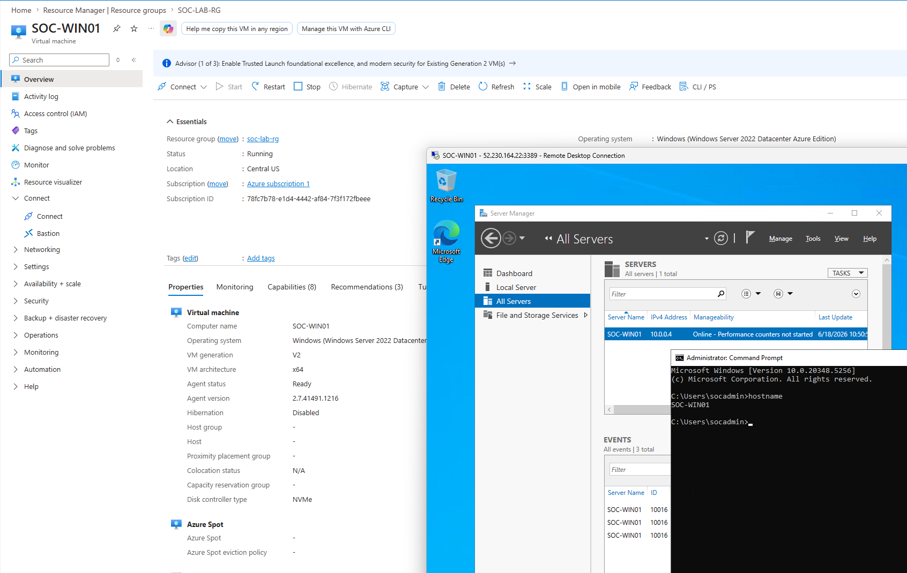
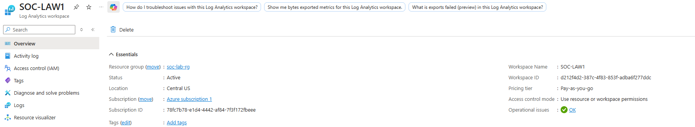
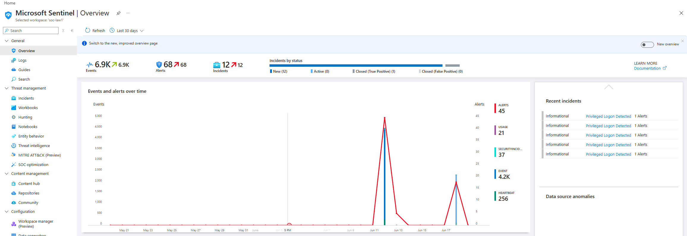
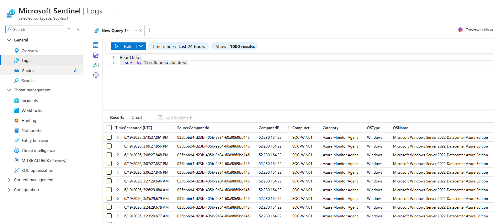
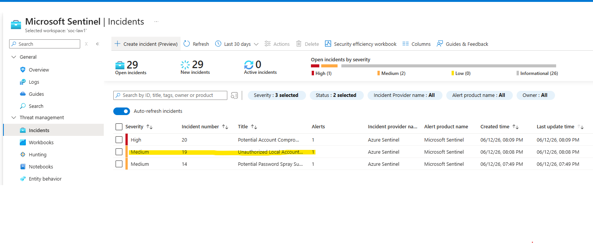
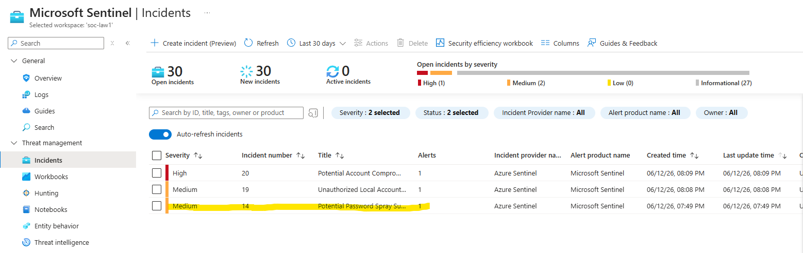

# Cloud-Based SOC & Detection Engineering Lab (Microsoft Sentinel)

## Overview

This project demonstrates the deployment of a cloud-based Security Operations Center (SOC) environment using Microsoft Sentinel, Azure Monitor, Log Analytics, and a Windows Server endpoint.

The goal was not simply to create detections, but to think like a Security Operations Center (SOC) analyst by:

- Collecting endpoint telemetry in a cloud SIEM
- Building custom detections using KQL
- Mapping detections to the MITRE ATT&CK framework
- Tuning alerts to reduce false positives
- Prioritizing incidents based on risk and confidence
- Investigating simulated attack activity

Rather than generating incidents for every security event, detections were tuned to reflect realistic SOC workflows where low-confidence events provide visibility while high-confidence events generate actionable incidents.

---

## Skills Demonstrated

- Microsoft Sentinel Deployment
- Kusto Query Language (KQL)
- Security Event Analysis
- MITRE ATT&CK Mapping
- Incident Response
- Alert Tuning
- Authentication Monitoring
- Security Operations Workflows

---

# Lab Architecture

Telemetry was collected from a Windows Server virtual machine using the Azure Monitor Agent and forwarded into Microsoft Sentinel for analysis.

## Architecture Diagram

  

---

# Environment Setup

## Azure Resources

The environment consisted of:

- Windows Server Virtual Machine
- Azure Monitor Agent
- Log Analytics Workspace
- Microsoft Sentinel
- Data Collection Rule (DCR)

### Azure Resource Group

  

---

## Endpoint Configuration

A Windows Server VM was deployed to simulate an enterprise endpoint and generate security telemetry.

### Windows Server VM

  

## Data Collection Rule (DCR)

A Data Collection Rule (DCR) was configured and associated with the Windows Server endpoint.

The DCR instructed the Azure Monitor Agent to collect Windows Security Audit events and forward them to the Log Analytics Workspace.

Collected Security Event Categories:

- Audit Success
- Audit Failure

These security audit logs contained the telemetry used throughout the project, including:

| Event ID | Description |
|-----------|-------------|
| 4624 | Successful Logon |
| 4625 | Failed Logon |
| 4672 | Privileged Logon |
| 4720 | User Account Creation |

  

The DCR served as the bridge between the endpoint and Microsoft Sentinel, enabling security event ingestion and detection engineering.

The Azure Monitor Agent (AMA) was installed to forward Security Event Logs to Log Analytics.

# Log Analytics Workspace (LAW)

A Log Analytics Workspace was deployed to serve as the central repository for collected endpoint telemetry.

The workspace stores security events collected by the Azure Monitor Agent and provides the data source queried by Microsoft Sentinel analytics rules.

Responsibilities of the Log Analytics Workspace included:

- Centralized log storage
- KQL query execution
- Security event retention
- Data source for Microsoft Sentinel detections

Without the Log Analytics Workspace, Microsoft Sentinel would have no telemetry available for detection engineering or incident generation.

  

# Microsoft Sentinel

Microsoft Sentinel was deployed as the Security Information and Event Management (SIEM) platform for the lab.

Sentinel consumes telemetry stored within the Log Analytics Workspace and enables:

- Detection engineering
- Alert generation
- Incident creation
- Threat hunting
- MITRE ATT&CK mapping
- Security investigations

Unlike the Log Analytics Workspace, which primarily stores data, Sentinel provides the security analytics and incident response capabilities used by SOC analysts.

The platform was used to create custom analytics rules, correlate suspicious activity, and generate incidents based on simulated attack scenarios.

  

---

## Log Collection Validation

Successful telemetry ingestion was validated using heartbeat events and Windows Security Logs.

### Example Security Events Collected

| Event ID | Description |
|----------|-------------|
| 4624 | Successful Logon |
| 4625 | Failed Logon |
| 4672 | Special Privileges Assigned |
| 4720 | User Account Created |

### Heartbeat Validation

The Heartbeat table was used to verify successful communication between the Windows Server endpoint, Azure Monitor Agent, and Log Analytics Workspace.

  

### Security Event Validation

Windows Security Event Logs were successfully collected and ingested into Log Analytics through the Azure Monitor Agent and Data Collection Rule.

The collected telemetry served as the foundation for all Sentinel detections and incident generation.

  

# Detection Engineering

The following detections were developed and mapped to MITRE ATT&CK techniques.

---

# Failed Authentication Burst

## Objective

Detect repeated authentication failures which may indicate password guessing or brute-force activity.

### Event ID

**4625 – Failed Logon**

### MITRE ATT&CK

**T1110 – Brute Force**

Attackers frequently attempt repeated authentication attempts against valid accounts.

### Detection Logic

Triggers when five or more failed authentication events occur.

### Severity

**Low**

### Incident Creation

**Disabled**

### SOC Rationale

This rule intentionally does not generate incidents.

Failed logins occur frequently in enterprise environments due to:

- User mistakes
- Forgotten passwords
- Service account issues
- Application authentication failures

Generating incidents for every burst of failed logins would create excessive alert fatigue.

Instead, this detection provides visibility and context for future investigations.

### Detection Results

  

---

# Successful Authentication Activity

## Objective

Monitor successful authentication activity.

### Event ID

**4624 – Successful Logon**

### MITRE ATT&CK

**T1078 – Valid Accounts**

Threat actors frequently abuse legitimate credentials after compromise.

### Detection Logic

Detects successful authentication events.

### Severity

**Informational**

### Incident Creation

**Disabled**

### SOC Rationale

Successful logins occur continuously throughout normal operations.

Creating incidents for routine user activity would provide little security value.

Instead, this detection serves as supporting telemetry during investigations.

### Detection Results

  

---

# Privileged Logon Detected

## Objective

Monitor use of elevated privileges.

### Event ID

**4672 – Special Privileges Assigned to New Logon**

### MITRE ATT&CK

**T1078 – Valid Accounts**

Attackers frequently attempt to obtain privileged access after compromising credentials.

### Detection Logic

Triggers when elevated privileges are assigned during authentication.

### Severity

**Informational**

### Incident Creation

**Disabled**

### SOC Rationale

Administrative logons are common in enterprise environments.

While privileged activity is important to monitor, generating incidents for every administrative logon would create excessive noise.

This detection is retained for investigation context and threat hunting.

### Detection Results

  

---

# Unauthorized Local Account Persistence Detection

## Objective

Detect creation of local user accounts which may be used to establish persistence.

### Event ID

**4720 – User Account Created**

### MITRE ATT&CK

**T1136 – Create Account**

Attackers frequently create accounts to maintain long-term access after initial compromise.

### Detection Logic

Triggers when a local account is created on the monitored endpoint.

### Severity

**Medium**

### Incident Creation

**Enabled**

### Why This Matters

Unlike authentication events, account creation is significantly less common.

Although legitimate administrators create accounts regularly, account creation is often associated with persistence mechanisms used by attackers.

This rule was elevated to incident status to provide immediate analyst visibility into potential persistence activity.

### Detection Results

  

### Generated Incident

  

---

# Potential Password Spray Success

## Objective

Detect successful authentication activity following multiple failed authentication attempts.

### Event IDs

- **4625 – Failed Logon**
- **4624 – Successful Logon**

### MITRE ATT&CK

- **T1110.003 – Password Spraying**
- **T1078 – Valid Accounts**

### Detection Logic

Correlates repeated authentication failures with subsequent successful authentication activity.

### Severity

**Medium**

### Incident Creation

**Enabled**

### Why This Matters

A successful authentication following multiple failures represents a higher-confidence indicator of compromise than failed logins alone.

This pattern may indicate:

- Password spraying
- Credential guessing
- Credential compromise

Because multiple events are correlated together, confidence is significantly higher than standalone authentication failures.

### Detection Results

  

### Generated Incident

  

---

# Potential Account Compromise and Persistence

## Objective

Correlate authentication activity and persistence-related behavior into a high-confidence incident.

### Event IDs

- **4625 – Failed Logon**
- **4624 – Successful Logon**
- **4720 – User Account Created**

### MITRE ATT&CK

- **T1110.003 – Password Spraying**
- **T1078 – Valid Accounts**
- **T1136 – Create Account**

### Detection Logic

Triggers when the following activities occur within the defined investigation window:

- Failed Authentication Activity
- Successful Authentication Activity
- Account Creation Activity

### Severity

**High**

### Incident Creation

**Enabled**

### SOC Rationale

This detection represents a higher-confidence attack scenario.

Rather than generating incidents for individual events, multiple suspicious activities are correlated together.

This significantly reduces false positives while increasing detection confidence.

The resulting incident more closely resembles real-world SOC detection engineering practices.

### Correlation Results

  

### Generated Incident

  

---
# Alert Tuning and Incident Prioritization

Not all detections were configured to generate incidents.

The following detections were retained as informational telemetry:

- Successful Authentication Activity
- Privileged Logon Detected
- Failed Authentication Burst

These events occur frequently in enterprise environments and would create excessive alert fatigue if every occurrence generated an incident.

The following detections were promoted to incidents:

- Unauthorized Local Account Persistence Detection
- Potential Password Spray Success
- Potential Account Compromise and Persistence

These detections represent higher-confidence indicators of malicious activity because they either indicate persistence or correlate multiple suspicious events together.

This approach reflects real-world SOC practices where analyst attention is reserved for high-value security events.

---

# Lessons Learned

A major lesson from this project was the importance of alert tuning and incident prioritization.

While many security events may initially appear suspicious, not every event warrants analyst investigation.

Examples include:

- Failed logons
- Successful logons
- Administrative logons

These events occur regularly in enterprise environments and are best used as supporting telemetry.

Higher-confidence detections were promoted to incidents only when activity suggested:

- Credential compromise
- Persistence
- Multi-stage attack behavior

This approach reduces alert fatigue while allowing analysts to focus on the most meaningful security events.

---

# Conclusion

This project demonstrates the deployment of a cloud-based SOC using Microsoft Sentinel and Azure Monitor, including endpoint telemetry collection, detection engineering, MITRE ATT&CK mapping, alert tuning, and incident generation.

By focusing on both technical implementation and SOC decision-making, the lab provided practical experience with how security analysts investigate, prioritize, and respond to security events in modern enterprise environments.