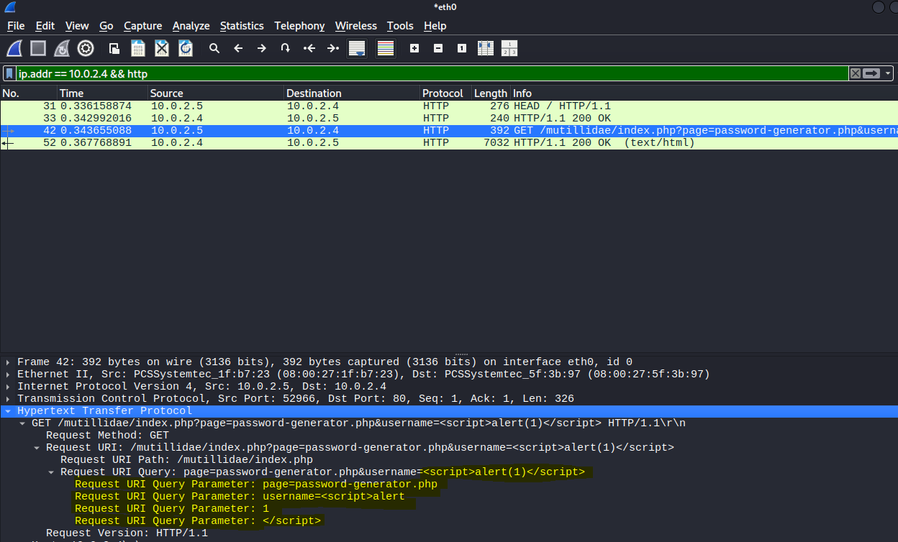
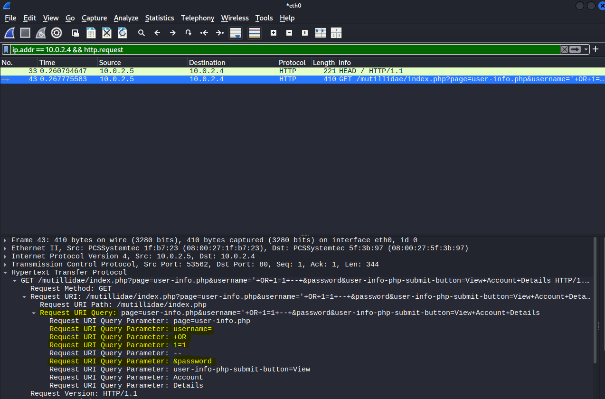

# Vulnerability Scanning & Network Traffic Analysis Lab

This lab demonstrates a hands-on vulnerability assessment performed in an isolated home lab environment. This project was self-designed to strengthen my understanding of vulnerability validation, network-level visibility, and defensive detection techniques commonly used in entry-level cybersecurity and SOC roles.


The lab combines service discovery, custom vulnerability scanning, and packet analysis to show how attack activity may appear in real-world monitoring environments. 

> All testing was performed against intentionally vulnerable systems in an isolated lab environment. No brute-force attacks, data exfiltration, or destructive actions were conducted.

### Lab Environment

- **Attacker / Scanner:** Kali Linux
- **Target:** Metasploitable2 (intentionally vulnerable system)
- **Network:** Isolated NAT network (VirtualBox)
- **Tools Used:**
  - Nmap
  - Nuclei (custom YAML templates)
  - Wireshark
  - Apache Mutillidae (vulnerable web app)

### Setup & Installation

Setup instructions for recreating this lab environment including virtual machine configuration, network setup, and tool installation, are available here:

**[View Setup & Installation Guide](Documentation/setup-and-installation.md)**


## Project Demo Video

This 8-minute walkthrough demonstrates the assessment workflow, including reconnaissance, vulnerability validation, and network traffic analysis from a defensive perspective. 

<p align="center">
  <a href="https://www.youtube.com/watch?v=r8Ln0K-WLH4">
    
  </a>
</p>


## Skills Demonstrated

This project demonstrates hands-on experience with several core cybersecurity concepts and skills relevant to entry-level security operations and vulnerability management roles, including:

- Network traffic capture, packet analysis, and TCP stream reconstruction using Wireshark
- Vulnerability identification and validation using custom Nuclei templates
- Web application vulnerability testing (JavaScript injection and SQL injection)
- Analysis of service misconfigurations and associated security risks
- Translating technical findings into defensive detection, risk assessment, and remediation considerations

### Assessment Workflow

1. [**Reconnaissance (Nmap)**](#reconnaissance-nmap)
2. [**Vulnerability Validation (Nuclei)**](#vulnerability-validation-nuclei)
3. [**Network Traffic Analysis (Wireshark)**](#network-traffic-analysis-wireshark)
4. [**Risk & Remediation**](#risk--remediation)
5. [**Recognizing Limitations**](#limitations)
6. [**References**](#references)


---

## Reconnaissance (Nmap)

Initial service discovery was performed to identify running services and versions on the target system.
To identify exposed services relevant to the vulnerability assessment, a targeted Nmap scan was performed against the Metasploitable host.

**Example command:**
```bash
nmap -sV -p 21,80,3632 10.0.2.4
```
This scan focuses only on services that were later validated using custom Nuclei templates. Results of the scan can be seen below.


The results show multiple exposed and outdated services, indicating an intentionally insecure host suitable for vulnerability testing:

- **FTP (21/tcp – vsftpd 2.3.4):** Legacy, unencrypted service commonly associated with weak authentication and unauthorized access risks.
- **HTTP (80/tcp – Apache 2.2.8):** Outdated web server hosting vulnerable web applications, serving as the attack surface for JavaScript and SQL injection testing.
- **distccd (3632/tcp):** Misconfigured distributed compiler service capable of unauthenticated remote command execution, later validated using a custom Nuclei backdoor template.

These findings were used to guide focused vulnerability scanning and packet-level analysis, rather than broad or unnecessary scanning.
This approach mirrors real-world assessment workflows, where reconnaissance is scoped to services that are most likely to introduce risk.

---

## Vulnerability Validation (Nuclei)

After identifying exposed services, I created custom Nuclei templates to validate specific vulnerabilities discovered during reconnaissance.  
Rather than relying on generic scans, each template was written to target a known weakness on the Metasploitable system.

This approach demonstrates how automated scanning can be tailored to specific environments and how findings can be validated in a controlled manner.


### JavaScript Injection Detection
---

A custom Nuclei template was created to test for reflected JavaScript injection within the Mutillidae web application hosted on the target.

**Nuclei YAML Template:**  [`JavaScriptinjection.yaml`](my-YAML-templates/JavaScriptinjection.yaml) 

The template sends a crafted payload designed to trigger JavaScript execution if input is improperly sanitized.

**Template focus:**
- Injects a `<script>` payload via URL parameters
- Checks the HTTP response body for reflected payload execution

**Impact:**
If exploited, JavaScript injection could allow an attacker to execute malicious scripts in a user’s browser, leading to session hijacking, credential theft, or unauthorized actions.

**Scanning and Results:**

The screenshot above shows the result of the Nuclei scan confirming the presence of a reflected JavaScript injection vulnerability.  
This indicates that the application is responding in a way that reflects user-controlled input back to the client without proper sanitization.

To better understand how this behavior appears at the network level, **[packet analysis](#http-injection-traffic-javascript--sql-injection)** was performed using Wireshark.


**Possible Solutions:**
- Input validation and output encoding
- Proper use of server-side sanitization
- Web application firewall (WAF) rules for script injection patterns

<br>

### SQL Injection Detection

---

A second custom Nuclei template was used to test for SQL injection vulnerabilities in user input fields within Mutillidae.

**Nuclei YAML Template:**  
[`SQLinjection.yaml`](my-YAML-templates/SQLinjection.yaml)


The template submits a basic authentication bypass payload to determine whether backend SQL queries are vulnerable to manipulation.

**Template focus:**
- Tests for improper SQL query handling
- Identifies authentication bypass behavior

**Impact:**
SQL injection can allow attackers to bypass authentication, extract sensitive data, or modify backend databases.

**Scanning and Results:**

The screenshot above shows the Nuclei scan successfully detecting a SQL injection condition within the application.

This result confirms that the application behaves differently when a crafted SQL payload is submitted, indicating improper handling of user input in backend database queries.  
To better understand how this input is transmitted and processed, **[further analysis](#http-injection-traffic-javascript--sql-injection)** was performed using Wireshark.


To further cement the finding, the vulnerable endpoint was accessed directly through the web application.

The screenshot below shows the application returning account information after a SQL injection payload was submitted. This behavior demonstrates that authentication logic can be bypassed, meaning that the vulnerability identified by Nuclei is exploitable at the application level.


This step helps bridge the gap between automated scanning results and real application behavior, showing that the issue is not only detectable by tools but also observable from a user perspective.


**Possible Solutions:**
- Parameterized queries (prepared statements)
- Input validation and least-privilege database permissions
- Regular application security testing

<br>

### distccd Backdoor Detection

---

A critical vulnerability was validated on the `distccd` service running on port **3632**.
This is a powerful C compiler that makes large scale compiling jobs easy. The issue is that can attacker can easily abuse this service to run commands as an admin. 

A custom Nuclei template was used to send a crafted TCP payload designed to execute a harmless system command (`id`) on the target, confirming remote command execution capability.

**Nuclei Template:**  
[`Unintentional_Backdoor.yaml`](my-YAML-templates/Unintentional_Backdoor.yaml)

**Template focus:**
- Detects unauthenticated command execution
- Confirms service misconfiguration

**Impact:**
This vulnerability allows attackers to execute arbitrary commands remotely, potentially leading to full system compromise.

**Scanning and Results:**


This finding indicates that the service is exposed and responding to crafted requests in a way that enables command execution without authentication. To better understand the severity of this issue, the corresponding network traffic was analyzed **[following a TCP stream](#distccd-backdoor-traffic-tcp-stream-analysis)** in Wireshark.


**Possible Solutions:**
- Disable unnecessary services
- Restrict network access to administrative services
- Patch or remove legacy software

<br><br>
---

## Network Traffic Analysis (Wireshark)

After validating vulnerabilities using custom Nuclei templates, Wireshark was used to capture and analyze network traffic generated during the scans.  
The goal of this analysis was to understand how vulnerability scanning and exploitation attempts appear at the packet level and how such activity could be detected in a monitored environment.

Traffic was captured on the Kali Linux interface during each scan and filtered to focus only on communication with the target host.

<br>

### HTTP Injection Traffic (JavaScript & SQL Injection)

---

Following validation of JavaScript and SQL injection vulnerabilities, HTTP traffic was analyzed to observe how malicious input is transmitted to the application.

Captured traffic shows crafted payloads being sent directly within HTTP requests to the vulnerable endpoints.

**JavaScript Injection Packet Capture:**  


In the Wireshark packet capture above, the HTTP request sent to the vulnerable endpoint can be inspected in more detail.

The request URI clearly shows the injected JavaScript payload included directly as a query parameter:
`<script>alert(1)</script>`

What’s important here is that the payload is transmitted in cleartext and reaches the application without being filtered or modified. This confirms that the application is accepting and processing unsanitized user input.

From a security perspective, this behavior is problematic because it allows attackers to inject arbitrary JavaScript into pages viewed by other users. While the payload used in this lab is harmless, similar techniques are commonly used to steal session cookies or perform unauthorized actions in real-world attacks.


**SQL Injection Packet Capture:**  


In this Wireshark capture, the HTTP request reveals the SQL injection payload included directly within the request URI.

The query parameter contains the classic logical bypass payload:
`' OR 1=1 --`

This payload alters the logic of the SQL query being executed by the application. The fact that it appears unencoded and unfiltered in the request suggests that user input is being passed directly into SQL statements without proper safeguards.

**Observed behavior:**
- Injection payloads visible in request URIs
- Cleartext transmission of malicious input
- Repeated requests targeting the same application endpoints

**Defensive perspective:**  
From a monitoring standpoint, these payload patterns are strong indicators of malicious activity. Web application firewalls (WAFs) and network monitoring tools can be configured to detect repeated injection attempts or suspicious query parameters.

<br>

### distccd Backdoor Traffic (TCP Stream Analysis)

---

After validating the misconfigured `distccd` service using a custom Nuclei template, Wireshark was used to analyze traffic on port **3632**, which is not commonly used in production environments.

By following the TCP stream, application-level data exchanged between the scanner and the target becomes visible.

**distccd TCP Stream Evidence:**  


The TCP stream shown above provides clear evidence of command execution occurring over port 3632.

Within the stream, we can see a shell command being sent to the service and the resulting output being returned by the system. Specifically, the output includes:
`uid=1(daemon) gid=1(daemon)`

This confirms that the command was executed by the system and that the service is running with daemon-level privileges. The fact that this interaction occurs without authentication makes this vulnerability particularly dangerous.


**Observed behavior:**
- Application-layer data transmitted over a non-standard port
- Command execution request sent without authentication
- Command output returned in the server response

**Defensive perspective:**  
Traffic containing command execution behavior on an uncommon port would be highly suspicious in a real environment and should trigger immediate investigation. This type of activity may indicate service abuse, misconfiguration, or active exploitation.


### Detection & Monitoring Considerations

This analysis highlights how vulnerability scanning and exploitation attempts can be observed at the network level. Key indicators defenders could monitor for include:

- Repeated HTTP requests containing injection patterns
- Unexpected payloads in request parameters
- Application-layer traffic on uncommon ports
- TCP streams containing command execution behavior

Understanding these patterns is essential for effective detection, alerting, and incident response.

---

## Risk & Remediation

This assessment identified multiple high-risk vulnerabilities resulting from outdated services, improper input handling, and misconfigured network-exposed applications.  
While this lab uses intentionally vulnerable systems, the findings reflect common issues seen in real-world environments.


### Overall Risk Assessment

| Vulnerability Type | Risk Level | Potential Impact |
|-------------------|------------|------------------|
| JavaScript Injection (XSS) | Medium | Session hijacking, client-side attacks |
| SQL Injection | High | Authentication bypass, data exposure |
| distccd Backdoor | Critical | Remote command execution, full system compromise |

The combination of these vulnerabilities significantly increases the likelihood of system compromise, especially if exposed to untrusted networks.

---

### Remediation Summary

At the application level, the most effective remediation involves properly handling user input before it is processed or returned to the client. Validating and sanitizing all user-supplied data, implementing output encoding, and using parameterized queries for database interactions would significantly reduce the risk of both JavaScript and SQL injection vulnerabilities observed in this lab.

From a system and network perspective, reducing the exposed attack surface is critical. Unnecessary services such as the `distccd` daemon should be disabled entirely if not required, and access to administrative or legacy services should be tightly restricted through firewall rules. Keeping software up to date and removing outdated components further limits opportunities for exploitation.

In addition to preventative controls, detection and monitoring play an important role in defense. Monitoring HTTP traffic for common injection patterns, alerting on application-layer traffic over uncommon ports, and investigating repeated or automated scanning behavior can help security teams identify and respond to suspicious activity before it escalates.

---

### Defensive Takeaway

This lab highlights how vulnerabilities often result from a combination of insecure application design, outdated services, and insufficient monitoring rather than a single misconfiguration. While tools like Nuclei are effective for identifying known weaknesses, the Wireshark analysis demonstrates the importance of understanding how malicious activity appears at the network level. Being able to correlate scanner findings with observable traffic patterns is a key skill for defensive security roles and reinforces the value of layered security controls and visibility across the environment.

---

## Limitations

This lab was conducted in a controlled, intentionally vulnerable environment and does not represent a hardened production system. The network traffic analyzed in this project is unencrypted and simplified, which makes certain attack patterns easier to observe than they might be in real-world environments where TLS, intrusion detection systems, and additional security controls are present.

Additionally, this assessment focuses on vulnerability validation and network-level visibility rather than exploitation depth or post-compromise activity. While the findings demonstrate realistic attack indicators, they are intended for educational and defensive analysis purposes rather than comprehensive penetration testing.


---

## References

The following resources were referenced throughout the creation of this lab to better understand vulnerabilities, tooling behavior, and expected outcomes in intentionally vulnerable environments:

- ProjectDiscovery. *Nuclei Documentation*.  
  https://docs.projectdiscovery.io/tools/nuclei/overview

- ProjectDiscovery. *Nuclei Templates GitHub Repository*.  
  https://github.com/projectdiscovery/nuclei-templates

- OWASP Foundation. *OWASP Top 10 Web Application Security Risks*.  
  https://owasp.org/www-project-top-ten/

- OWASP Foundation. *SQL Injection*.  
  https://owasp.org/www-community/attacks/SQL_Injection

- OWASP Foundation. *Cross-Site Scripting (XSS)*.  
  https://owasp.org/www-community/attacks/xss/

- Rapid7. *Metasploitable2 Exploitability Guide*.  
  https://docs.rapid7.com/metasploit/metasploitable-2/
