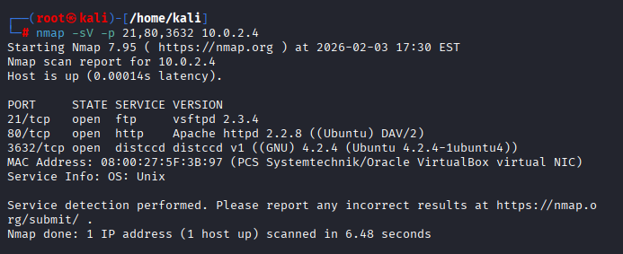
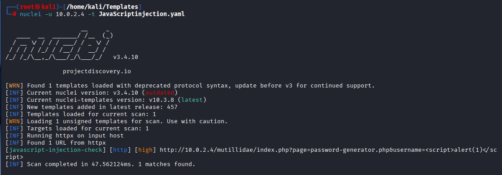
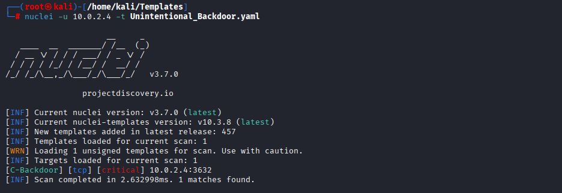

# Vulnerability Scanning & Network Traffic Analysis Lab

This project demonstrates a hands-on vulnerability assessment performed in an isolated home lab environment. The goal of this lab is to understand how vulnerabilities are discovered, validated, and observed at the network level from a defensive cybersecurity perspective.

The lab combines service discovery, custom vulnerability scanning, and packet analysis to show how attack activity may appear in real-world monitoring environments.

---

## 🔧 Lab Environment

- **Attacker / Scanner:** Kali Linux
- **Target:** Metasploitable2 (intentionally vulnerable system)
- **Network:** Isolated NAT network (VirtualBox)
- **Tools Used:**
  - Nmap
  - Nuclei (custom YAML templates)
  - Wireshark
  - Apache Mutillidae (vulnerable web app)

---

## 🧭 Assessment Workflow

1. **Reconnaissance:** Identify exposed services using Nmap
2. **Vulnerability Validation:** Use custom Nuclei templates to confirm specific issues
3. **Network Analysis:** Capture and analyze scan traffic with Wireshark
4. **Risk & Remediation:** Assess impact and outline mitigation strategies

---

## 🔍 Reconnaissance (Nmap)

Initial service discovery was performed to identify running services and versions on the target system.
To identify exposed services relevant to the vulnerability assessment, a targeted Nmap scan was performed against the Metasploitable host.

**Example command:**
```bash
nmap -sV -p 21,80,3632 10.0.2.4
```
This scan focuses only on services that were later validated using custom Nuclei templates. Results of the scan can be seen below.



This targeted Nmap scan was performed to confirm the presence of services that were later validated using custom Nuclei templates.

The results show multiple exposed and outdated services, indicating an intentionally insecure host suitable for vulnerability testing:

- **FTP (21/tcp – vsftpd 2.3.4):** Legacy, unencrypted service commonly associated with weak authentication and unauthorized access risks.
- **HTTP (80/tcp – Apache 2.2.8):** Outdated web server hosting vulnerable web applications, serving as the attack surface for JavaScript and SQL injection testing.
- **distccd (3632/tcp):** Misconfigured distributed compiler service capable of unauthenticated remote command execution, later validated using a custom Nuclei backdoor template.

These findings were used to guide focused vulnerability scanning and packet-level analysis, rather than broad or unnecessary scanning.
This approach mirrors real-world assessment workflows, where reconnaissance is scoped to services that are most likely to introduce risk.

---

## 🚨 Vulnerability Validation (Nuclei)

After identifying exposed services, custom Nuclei templates were used to validate specific vulnerabilities discovered during reconnaissance.  
Rather than relying on generic scans, each template was written to target a known weakness on the Metasploitable system.

This approach demonstrates how automated scanning can be tailored to specific environments and how findings can be validated in a controlled manner.

---

### 🧪 JavaScript Injection Detection

A custom Nuclei template was created to test for reflected JavaScript injection within the Mutillidae web application hosted on the target.

The template sends a crafted payload designed to trigger JavaScript execution if input is improperly sanitized.

**Template focus:**
- Injects a `<script>` payload via URL parameters
- Checks the HTTP response body for reflected payload execution

**Impact:**
If exploited, JavaScript injection could allow an attacker to execute malicious scripts in a user’s browser, leading to session hijacking, credential theft, or unauthorized actions.

**Remediation:**
- Input validation and output encoding
- Proper use of server-side sanitization
- Web application firewall (WAF) rules for script injection patterns



---

### 🧪 SQL Injection Detection

A second custom Nuclei template was used to test for SQL injection vulnerabilities in user input fields within Mutillidae.

The template submits a basic authentication bypass payload to determine whether backend SQL queries are vulnerable to manipulation.

**Template focus:**
- Tests for improper SQL query handling
- Identifies authentication bypass behavior

**Impact:**
SQL injection can allow attackers to bypass authentication, extract sensitive data, or modify backend databases.

**Remediation:**
- Parameterized queries (prepared statements)
- Input validation and least-privilege database permissions
- Regular application security testing


---

### 🧪 distccd Backdoor Detection

A critical vulnerability was validated on the `distccd` service running on port **3632**.

A custom Nuclei template was used to send a crafted TCP payload designed to execute a benign system command (`id`) on the target, confirming remote command execution capability.

**Template focus:**
- Detects unauthenticated command execution
- Confirms service misconfiguration

**Impact:**
This vulnerability allows attackers to execute arbitrary commands remotely, potentially leading to full system compromise.

**Remediation:**
- Disable unnecessary services
- Restrict network access to administrative services
- Patch or remove legacy software


