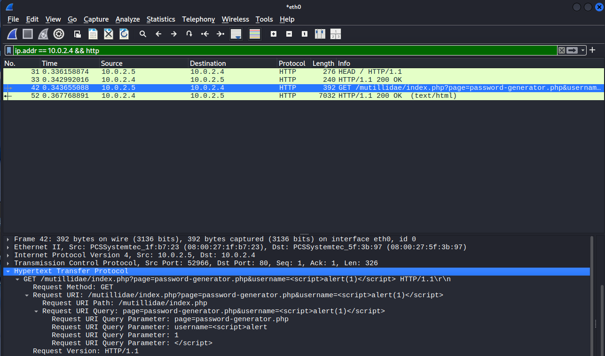

# Vulnerability Scanning & Network Traffic Analysis Lab

This project demonstrates a hands-on vulnerability assessment performed in an isolated home lab environment. The goal of this lab is to understand how vulnerabilities are discovered, validated, and observed at the network level from a defensive cybersecurity perspective.

The lab combines service discovery, custom vulnerability scanning, and packet analysis to show how attack activity may appear in real-world monitoring environments.


### Lab Environment

- **Attacker / Scanner:** Kali Linux
- **Target:** Metasploitable2 (intentionally vulnerable system)
- **Network:** Isolated NAT network (VirtualBox)
- **Tools Used:**
  - Nmap
  - Nuclei (custom YAML templates)
  - Wireshark
  - Apache Mutillidae (vulnerable web app)


### Assessment Workflow

1. [**Reconnaissance (Nmap)**](#reconnaissance-nmap)
2. [**Vulnerability Validation (Nuclei)**](#vulnerability-validation-nuclei)
3. [**Network Traffic Analysis (Wireshark)**](#network-traffic-analysis-wireshark)
4. [**Risk & Remediation**](#risk--remediation)

---

## Reconnaissance (Nmap)

Initial service discovery was performed to identify running services and versions on the target system.
To identify exposed services relevant to the vulnerability assessment, a targeted Nmap scan was performed against the Metasploitable host.

**Example command:**
```bash
nmap -sV -p 21,80,3632 10.0.2.4
```
This scan focuses only on services that were later validated using custom Nuclei templates. Results of the scan can be seen below.


This targeted Nmap scan was performed to confirm the presence of services that were later validated using custom Nuclei templates.

The results show multiple exposed and outdated services, indicating an intentionally insecure host suitable for vulnerability testing:

- **FTP (21/tcp – vsftpd 2.3.4):** Legacy, unencrypted service commonly associated with weak authentication and unauthorized access risks.
- **HTTP (80/tcp – Apache 2.2.8):** Outdated web server hosting vulnerable web applications, serving as the attack surface for JavaScript and SQL injection testing.
- **distccd (3632/tcp):** Misconfigured distributed compiler service capable of unauthenticated remote command execution, later validated using a custom Nuclei backdoor template.

These findings were used to guide focused vulnerability scanning and packet-level analysis, rather than broad or unnecessary scanning.
This approach mirrors real-world assessment workflows, where reconnaissance is scoped to services that are most likely to introduce risk.

---

## Vulnerability Validation (Nuclei)

After identifying exposed services, custom Nuclei templates were used to validate specific vulnerabilities discovered during reconnaissance.  
Rather than relying on generic scans, each template was written to target a known weakness on the Metasploitable system.

This approach demonstrates how automated scanning can be tailored to specific environments and how findings can be validated in a controlled manner.


### JavaScript Injection Detection
---

A custom Nuclei template was created to test for reflected JavaScript injection within the Mutillidae web application hosted on the target.

**Nuclei YAML Template:**  [`JavaScriptinjection.yaml`](my-YAML-templates/JavaScriptinjection.yaml) 

The template sends a crafted payload designed to trigger JavaScript execution if input is improperly sanitized.

**Template focus:**
- Injects a `<script>` payload via URL parameters
- Checks the HTTP response body for reflected payload execution

**Impact:**
If exploited, JavaScript injection could allow an attacker to execute malicious scripts in a user’s browser, leading to session hijacking, credential theft, or unauthorized actions.

**Remediation:**
- Input validation and output encoding
- Proper use of server-side sanitization
- Web application firewall (WAF) rules for script injection patterns


<br>

### SQL Injection Detection

---

A second custom Nuclei template was used to test for SQL injection vulnerabilities in user input fields within Mutillidae.

**Nuclei YAML Template:**  
[`SQLinjection.yaml`](my-YAML-templates/SQLinjection.yaml)


The template submits a basic authentication bypass payload to determine whether backend SQL queries are vulnerable to manipulation.

**Template focus:**
- Tests for improper SQL query handling
- Identifies authentication bypass behavior

**Impact:**
SQL injection can allow attackers to bypass authentication, extract sensitive data, or modify backend databases.

**Remediation:**
- Parameterized queries (prepared statements)
- Input validation and least-privilege database permissions
- Regular application security testing


<br>

### distccd Backdoor Detection

---

A critical vulnerability was validated on the `distccd` service running on port **3632**.

A custom Nuclei template was used to send a crafted TCP payload designed to execute a benign system command (`id`) on the target, confirming remote command execution capability.

**Nuclei Template:**  
[`Unintentional_Backdoor.yaml`](my-YAML-templates/Unintentional_Backdoor.yaml)

**Template focus:**
- Detects unauthenticated command execution
- Confirms service misconfiguration

**Impact:**
This vulnerability allows attackers to execute arbitrary commands remotely, potentially leading to full system compromise.

**Remediation:**
- Disable unnecessary services
- Restrict network access to administrative services
- Patch or remove legacy software


<br><br>
---

## Network Traffic Analysis (Wireshark)

After validating vulnerabilities using custom Nuclei templates, Wireshark was used to capture and analyze network traffic generated during the scans.  
The goal of this analysis was to understand how vulnerability scanning and exploitation attempts appear at the packet level and how such activity could be detected in a monitored environment.

Traffic was captured on the Kali Linux interface during each scan and filtered to focus only on communication with the target host.

<br>

### HTTP Injection Traffic (JavaScript & SQL Injection)

---

Following validation of JavaScript and SQL injection vulnerabilities, HTTP traffic was analyzed to observe how malicious input is transmitted to the application.

Captured traffic shows crafted payloads being sent directly within HTTP requests to the vulnerable endpoints.

**Observed behavior:**
- Injection payloads visible in request URIs
- Cleartext transmission of malicious input
- Repeated requests targeting the same application endpoints

📸 **JavaScript Injection Packet Capture:**  


📸 **SQL Injection Packet Capture:**  


**Defensive perspective:**  
From a monitoring standpoint, these payload patterns are strong indicators of malicious activity. Web application firewalls (WAFs) and network monitoring tools can be configured to detect repeated injection attempts or suspicious query parameters.
<br>

### distccd Backdoor Traffic (TCP Stream Analysis)

---

After validating the misconfigured `distccd` service using a custom Nuclei template, Wireshark was used to analyze traffic on port **3632**, which is not commonly used in production environments.

By following the TCP stream, application-level data exchanged between the scanner and the target becomes visible.

📸 **distccd TCP Stream Evidence:**  


**Observed behavior:**
- Application-layer data transmitted over a non-standard port
- Command execution request sent without authentication
- Command output returned in the server response

**Defensive perspective:**  
Traffic containing command execution behavior on an uncommon port would be highly suspicious in a real environment and should trigger immediate investigation. This type of activity may indicate service abuse, misconfiguration, or active exploitation.

---

### Detection & Monitoring Considerations

This analysis highlights how vulnerability scanning and exploitation attempts can be observed at the network level. Key indicators defenders could monitor for include:

- Repeated HTTP requests containing injection patterns
- Unexpected payloads in request parameters
- Application-layer traffic on uncommon ports
- TCP streams containing command execution behavior

Understanding these patterns is essential for effective detection, alerting, and incident response.

---

## Risk & Remediation

This assessment identified multiple high-risk vulnerabilities resulting from outdated services, improper input handling, and misconfigured network-exposed applications.  
While this lab uses intentionally vulnerable systems, the findings reflect common issues seen in real-world environments.


### Overall Risk Assessment

| Vulnerability Type | Risk Level | Potential Impact |
|-------------------|------------|------------------|
| JavaScript Injection (XSS) | Medium | Session hijacking, client-side attacks |
| SQL Injection | High | Authentication bypass, data exposure |
| distccd Backdoor | Critical | Remote command execution, full system compromise |

The combination of these vulnerabilities significantly increases the likelihood of system compromise, especially if exposed to untrusted networks.

---

### Remediation Summary

**Application-Level Fixes**
- Validate and sanitize all user input
- Implement output encoding to prevent script execution
- Use parameterized queries for database interactions

**System & Network Hardening**
- Disable unnecessary services such as distccd
- Restrict administrative services using firewall rules
- Patch or remove legacy software versions

**Detection & Monitoring**
- Monitor HTTP requests for injection patterns
- Alert on application-layer traffic over uncommon ports
- Investigate repeated or automated scanning behavior

---

### Defensive Takeaway

This lab reinforces the importance of layered security controls. While vulnerability scanners can identify issues, effective defense relies on proper configuration, continuous monitoring, and timely remediation to reduce overall risk.
